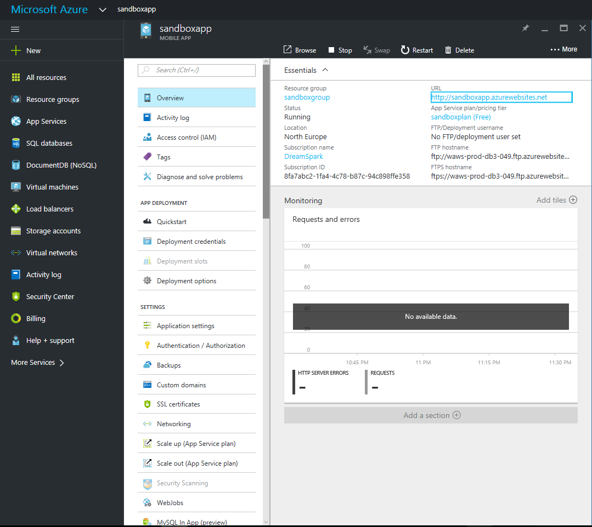
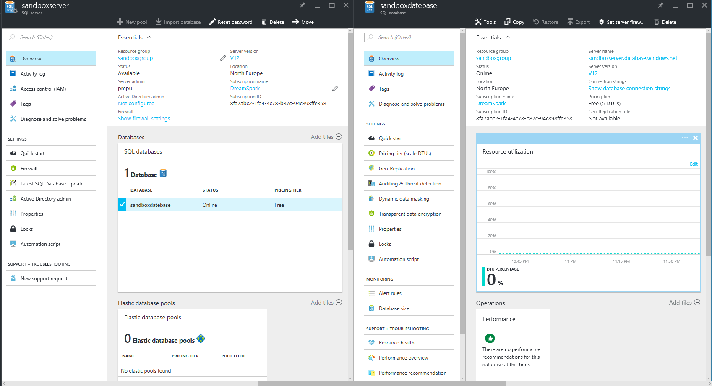
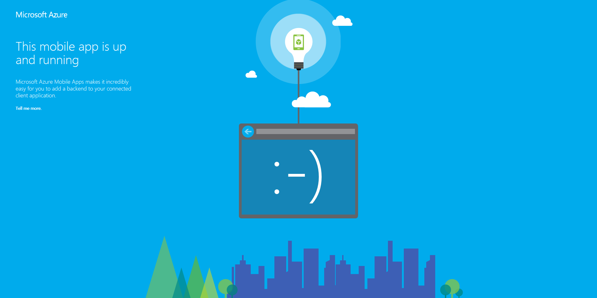

# ConferenceBackend

Hello there!

This spring we created a mobile app for a conference <a href="http://spisok.math.spbu.ru/2016/"> SPISOK </a> (download at<a href="https://play.google.com/store/apps/details?id=com.pfedotovsky.spisok"> Play Store </a>)

But there was very primitive backend

So we decided to create new with <strike>blackjack and hookers</strike>

We've chosen Microsoft Azure and create mobile app 

Create new server and datebase

And deploy it!

So, the next stage is adding all needed date, generate controllers (auto-generation is amazing!) and work with FrontEnd!

#All the best,

#Yury
